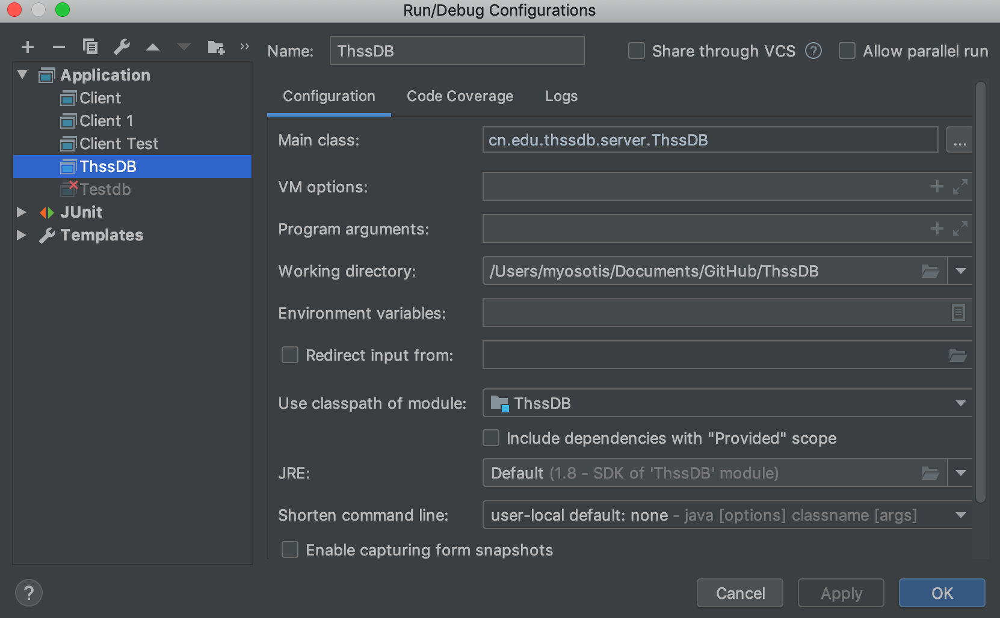
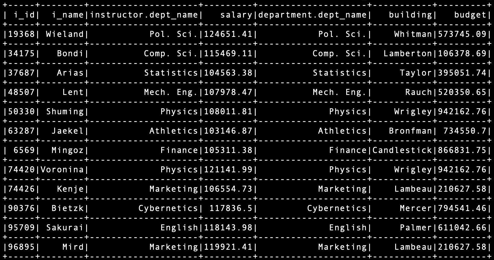

# ThssDB用户文档

该文档为用户手册，用于说明用户运行数据库程序的方式，以及对数据库支持的操作进行解释。

## 服务器

### 启动服务器

服务器的入口在cn.edu.thssdb.server.ThssDB处，可以通过以下两种方式运行：

- 从IDEA中运行，需要添加configuration使Main class指向cn.edu.thssdb.server.ThssDB，如下图所示:

此时服务器存放数据库文件的根目录在项目的根目录即project文件夹。

- 从jar包运行，进入exe文件夹下执行如下指令：
```
java -cp ThssDB-1.0-SNAPSHOT-jar-with-dependencies.jar cn.edu.thssdb.server.ThssDB
```
此时服务器存放数据库文件的根目录在jar包所在目录即exe文件夹。注：该jar包已经打包了依赖库，直接执行以上指令即可正常运行。

服务器启动时会读取db文件夹下的持久化文件，然后读取db/log文件进行数据恢复（如果是第一次运行，db文件夹还未创建，则会跳过该步骤）。

## 重置数据库

对数据库进行清空重置，只需要删除db文件夹并重启服务器即可。

## 客户端

包含两种客户端，Client是正常实现的客户端，Client_test是助教发放的测试文件中的客户端。

### 客户端启动

客户端程序可以从IDEA项目中启动，方法与服务器类似，以下主要介绍从jar包启动的方法。

#### Client客户端

进入exe文件夹下执行如下指令启动：
```
java -cp ThssDB-1.0-SNAPSHOT-jar-with-dependencies.jar cn.edu.thssdb.client.Client
```

#### Client_test客户端（用于测试的客户端）

进入exe文件夹下执行如下指令启动：
```
java -cp ThssDB-1.0-SNAPSHOT-jar-with-dependencies.jar cn.edu.thssdb.client.Client_test
```

用于Client_test用于自动测试，所以需要保证insert_into.sql文件在同级目录下。

### 指令与提示

客户端指令需要以分号";"结尾，指令执行成功或失败都会有提示信息。

### 连接服务器

数据库登录的用户名为：SA，密码为空，为了方便使用已经在代码中写好，只需要分别执行以下指令就连接服务器和断开连接。

```
connect;
disconnect;
```

### 操作数据库

数据库支持的操作以及相应指令说明如下，其中示例数据为Client_test自动测试导入的大学数据库数据。

#### 数据库级操作

- 创建数据库
```
create database <DATABASE NAME>;
```
- 删除数据库
```
drop database <DATABASE NAME>;
```
- 选择数据库
```
use <DATABASE NAME>;
```

#### 表级操作

执行表级操作前必须选择数据库。

- 创建表
```
create table <TABLE NAME>(<FIELD 1> <TYPE 1>, <FIELD 2> <TYPE 2>,..., <FIELD N> <TYPE N> not null,..., primary key(<FIELD PRI>));
```
如果建表语句中未指明primary key，则数据库会默认以第一个Field为primary key。

对于String类型的数据还需要在TYPE后指明最大长度，详见示例。

示例：
``` sql
create table t(a int, b int, c string(64), primary key (a));
```
- 删除表
```
drop table <TABLE NAME>;
```
- 显示Schema
```
show table <TABLE NAME>;
```
- 插入记录
```
insert into <TABLE NAME>[(<FIELD 1>, <FIELD 2>,..., <FIELD N>)] values (<VALUE 1>, <VALUE 2>,..., <VALUE N>);
```
示例：
``` sql
insert into student(s_id, s_name, dept_name, tot_cred) values ('101', 'test_student', 'Math', 100);
```

- 删除记录
```
delete from <TABLE NAME> where <FIELD> = <VALUE>;
```
示例：
``` sql
delete from student where s_id='66008';
```
- 更新记录
``` 
update <TABLE NAME> set <FIELD 1> = <VALUE 1> where <FIELD 2> = <VALUE 2>;
```
示例：
``` sql
update student set s_name='Dell' where s_id='76291';
```
- 查询记录
```
select [<TABLE NAME 1>.]<FILED 1 1>, [<TABLE NAME 1>.]<FILED 1 2>,..., [<TABLE NAME 2>.]<FILED 2 1>, [<TABLE NAME 2>.]<FILED 2 2>... from <TABLE NAME 1> [join <TABLE NAME 2> on [<TABLE NAME FIRST>.]<FILED FIRST> = [<TABLE NAME SECOND>.]<FILED SECOND>] [WHERE [<TABLE NAME FIRST>.]<FILED FIRST> = [<TABLE NAME SECOND>.]<FILED SECOND>];
```
查询的Field前是否必须加表名取决于是否会产生歧义，如果未加表名导致歧义则会报错。返回的结果中如果有相同的列名，则会在前面加上表名。

where和on子句中的条件语句，条件运算符两边的操作数必须为同类型，即同为字符串或同为数值，否则会报操作数类型不匹配错误。

条件运算符两边可以是包含运算符的算数表达式，可以执行一层四则运算，但要求参与四则运算的必须是数值；也可以是单值，为常数或从表中某行的一个Entry中取值。

支持select * 语句。

示例:
``` sql
select * from instructor join department on instructor.dept_name=department.dept_name where salary>=100000+1;
```


### 事务支持

客户端连接数据库服务器以后，默认为自动提交，即执行一条语句后自动commit。要关闭或开启自动commit可执行以下语句：

``` sql
set auto commit false;
set auto commit true;
```

启动一个新的事务需要执行：

``` sql
begin transaction;
```

执行完语句后需要通过commit提交：

``` sql
commit;
```

示例：
``` sql
set auto commit false;
begin transaction;
insert into department values('thss', 'tsinghua', 1000000.00);
delete from department where dept_name='thss';
commit;
```

只有在执行commit后，对数据的修改语句才会写到log日志中。当log日志条数大于100时，将对数据库进行持久化，之后log文件被清空。

数据库实现的隔离级别为Read Committed，可以防止脏读，具体请见设计文档中事务与恢复模块。